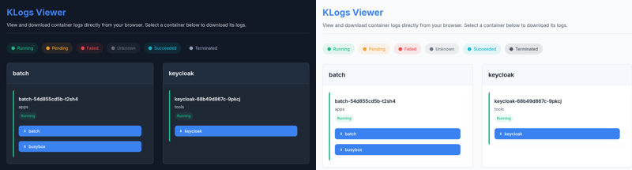

# klogs Viewer


KLogs Viewer is a lightweight, web-based application that allows you to view and download Kubernetes pod logs directly in your browser. Designed for developers and operators who need quick access to container logs without using the command line.



## ✨ Features

- **Efficient Table Layout**: View all pods and containers in a single, space-efficient table
- **Quick Filters**: Filter by namespace, label, or status with a single click
- **Search Functionality**: Instantly find pods or containers with the search feature
- **One-click Downloads**: Download container logs with a single click
- **Real-time Streaming**: Stream logs directly in your browser
- **Multi-container Support**: Access logs from any container in multi-container pods
- **Visual Status Indicators**: Clear visual indicators show pod status (Running, Pending, Failed, etc.)
- **Dark Mode Support**: Comfortable viewing in any lighting condition
- **Optional Authentication**: Token-based protection for secure deployments

## 🚀 Getting Started

### Deploy with Helm
```bash
# Add Helm repository
helm repo add rogosprojects https://rogosprojects.github.io/helm
# Update Helm repositories
helm repo update
# Install
helm install klogs-viewer rogosprojects/klogs-viewer
```
**Done!** Follow the post-installation message to discover the log page URL.

[Read the full **Helm chart documentation** with default values.yaml](https://rogosprojects.github.io/helm/charts/klogs-viewer/)

### Environment Variables

| Variable | Description | Default |
|----------|-------------|---------|
| `NAMESPACE` | Kubernetes namespace to monitor | Default namespace |
| `POD_LABELS` | Comma-separated list of pod label selectors | `app=*` |
| `TOKEN` | Optional authentication token | (none) |
| `REPLACE_LABEL` | Custom label replacement pattern | `app=` |
| `BASE_PATH` | Base path for the application | `/logs` |

#### Rate Limiting Configuration

| Variable | Description | Default |
|----------|-------------|---------|
| `RATE_LIMIT` | Number of requests allowed per minute per IP | `10` |
| `RATE_BURST` | Maximum burst size allowed | `20` |
| `VISITOR_TTL` | Time (in minutes) to keep inactive clients in memory | `60` |
| `CLEANUP_INTERVAL` | Frequency (in minutes) to clean up inactive clients | `60` |

#### WebSocket Security Configuration

| Variable | Description | Default |
|----------|-------------|---------|
| `ALLOWED_ORIGINS` | Comma-separated list of origins allowed to connect via WebSocket | Same-origin only |

## 🔒 Security

When deploying to production, we recommend:

1. Setting the `TOKEN` environment variable for authentication
2. Using a specific namespace rather than cluster-wide access
3. Deploying behind an ingress with TLS
4. Configuring appropriate rate limits for your expected traffic patterns
5. Setting appropriate origin restrictions for WebSocket connections:
   - For single-domain deployments: leave `ALLOWED_ORIGINS` empty to enforce same-origin policy
   - For multi-domain deployments: set `ALLOWED_ORIGINS` to a comma-separated list of allowed domains
   - For testing/development only: set `ALLOWED_ORIGINS=*` (not recommended for production)


## 🛠️ Building from Source

```bash
# Clone the repository
git clone https://github.com/rogosprojects/klogs-viewer.git
cd klogs-viewer

# Build the Docker image
docker build -t klogs-viewer:latest .

```

## 🤝 Contributing

Contributions are welcome! Please feel free to submit a Pull Request.

## 📄 License

This project is licensed under the MIT License - see the LICENSE file for details.
